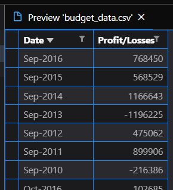
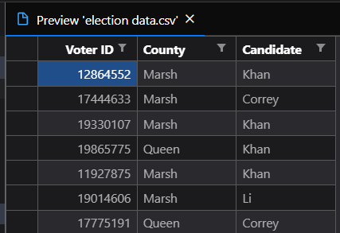
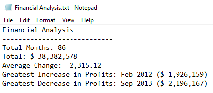
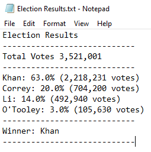

# Analizing simple data through Python

This excercise is to show what can be done with data through code in Python.

## Data

For this example I used two CSV files with diferent information:

-----

One of them with financial records with only two columns, `Date` and `Profit/Losses`.

Objective with this data is to analize:

* Number of months included.

* Net total over the entire period.

* Average changes in `Profit/Losses`.

* Greatest increase in profits and decrease in losses.

-----

The second data contains information about an election results, there are 3 columns in this data set, `Voter ID`, `County` and `Candidate`.

The objective in this case was to:

* Count the total number of votes

* List of candidates with votes

* Number of votes per cadidate

* Winner of the election.

## Results

The txt file for each results can be found inside the folder Results. The screens of those can be found next.

## Copyright

Trilogy Education Services © 2019. All Rights Reserved.
